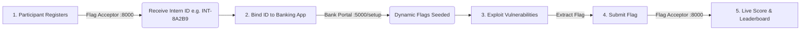

# 🏦 AdvancedVulnBank & CTF Flag Acceptor Platform

[](https://github.com/Yohannes18/AVB)
[](https://www.python.org/)
[](https://flask.palletsprojects.org/)
[](https://www.docker.com/)

A modern, production-grade cybersecurity training and Capture-The-Flag (CTF) benchmark platform. **AdvancedVulnBank** models a feature-rich online banking portal embedded with real-world security vulnerabilities, integrated alongside a centralized, glassmorphic **CTF Flag Acceptor Portal** for real-time candidate scoring and cohort progress tracking.

---

## 🌟 Key Platform Features

### 🏦 Vulnerable Banking Target Application (Port 5000)
- **Real-World Banking Workflows**: Includes account registration, multi-factor authentication, funds transfer, transaction history, profile management, file uploads, and balance auditing.
- **Dynamic Cryptographic Flag Engine**: Flags are dynamically generated using participant-specific cryptographic hashes (`Intern ID` + Secret Salt). This prevents flag hardcoding and candidate flag sharing during competitions.
- **33 Actionable Challenge Vectors**: Spans OWASP Top 10 vulnerabilities, advanced cryptographic weaknesses, race conditions, deserialization gadget chains, and cloud/infrastructure misconfigurations.

### 🚩 Categorized CTF Flag Acceptor Portal (Port 8000)
- **Categorized Participant Dashboard**: Organizes challenges into 7 thematic security domains (SQLi, RCE, Auth/XSS, JWT/OAuth, File Systems, SSRF, Cryptography).
- **Persistent Student Session ID**: Two-step registration (`check` / `create`) issuing persistent intern identifiers (e.g. `INT-8A2B9`).
- **Real-Time Validation & Hints**: Instant submission feedback, solved indicators (`✔️ Solved`), and progressive vulnerability hints.
- **Administrative Leaderboard (`/admin/leaderboard`)**: Real-time cohort analytics, participant score breakdowns, submission timestamps, and complete student ranking tables.

### 🛡️ Enterprise-Grade Infrastructure & State Management
- **Automated Rolling DB Snapshots**: Background worker thread performing non-blocking 15-minute database backups with automatic 10-file rolling pruning.
- **Startup Integrity Auditing**: Automatic volume mount and SQLite schema state verification on container startup.
- **Comprehensive Automated Test Suite (`tests/`)**: Standardized `pytest` test suite covering authentication, API endpoints, role restrictions, and database persistence.

---

## 🎯 Vulnerability Categories & Challenge Domains

| Category | Challenges | Key Vulnerabilities & Concepts Covered |
| :--- | :---: | :--- |
| 💉 **SQL Injection (SQLi)** | 7 | Auth bypass on login, registration insert injection, UNION search extraction, balance manipulation, profile update injection, API database dump, blind time-based & stacked queries. |
| ⚡ **Code Execution & Deserialization** | 6 | Backup OS command injection, Python `eval()` dynamic execution, Jinja2 Server-Side Template Injection (SSTI), Python Pickle RCE, PyYAML unsafe loading, multi-stage gadget chains. |
| 🔐 **Auth, Session & XSS** | 8 | Hardcoded secret keys, persistent XSS in comments, Insecure Direct Object References (IDOR), session fixation, password reset logic bypass, custom HTTP header role elevation (`X-Admin-Role`), unauthenticated mass data export, environment debug disclosure. |
| 🔑 **JWT & OAuth** | 3 | Weak HMAC secret signature cracking/forgery, RS256 -> HS256 algorithm confusion, OAuth open redirect token leakage. |
| 📁 **File Systems & Uploads** | 4 | Local File Inclusion (LFI), XML External Entity (XXE), unrestricted file upload web shells, Zip Slip archive path traversal. |
| 🌐 **SSRF Infrastructure** | 2 | Basic internal URL fetcher, advanced DNS rebinding and IP blocklist bypass. |
| ⚙️ **Crypto & Logic Flaws** | 3 | TOCTOU double-spend race condition, static AES IV / ECB ciphertext block attacks, small RSA prime factorization without padding. |

---

## 🚀 Participant Workflow



1. **Register Participant Session**: Access the **Flag Acceptor** at `http://<HOST_IP>:8000`. Enter your email/student ID to generate your persistent `Intern ID` (e.g. `INT-8A2B9`).
2. **Bind ID to Target Application**: Access **AdvancedVulnBank** at `http://<HOST_IP>:5000/setup` and input your `Intern ID`. This binds your session and seeds all challenge flags to your identifier.
3. **Analyze & Exploit**: Audit the banking application for vulnerabilities across web, API, and system layers to retrieve flags.
4. **Submit & Track**: Submit extracted flags on your **Flag Acceptor** dashboard (`http://<HOST_IP>:8000/dashboard`) to earn points and track cohort progress.

---

## ⚙️ Quick Start & Local Deployment

### Prerequisites
- [Docker](https://docs.docker.com/get-docker/) & [Docker Compose](https://docs.docker.com/compose/)
- Python 3.10+ (for local test suite execution)

### 1. Clone & Launch Container Stack
```bash
git clone https://github.com/Yohannes18/AVB.git
cd AVB
docker compose up -d --build
```

### 2. Verify Running Services
```bash
docker compose ps
```
- **Vulnerable Bank Portal**: `http://localhost:5000`
- **CTF Flag Acceptor**: `http://localhost:8000`

---

## ☁️ Production AWS EC2 Deployment

### 1. Provision EC2 Instance
Ensure your AWS CLI is configured (`aws configure`). Launch an Ubuntu EC2 instance using the provided deployment helper:
```bash
bash deploy_aws.sh
```

### 2. Sync Repository Code
Copy the project codebase to `/opt/vulnbank` on the EC2 instance:
```bash
scp -i /path/to/aws-key.pem -r ./* ubuntu@<EC2-INSTANCE-IP>:/opt/vulnbank/
```

### 3. Start Production Stack
```bash
ssh -i /path/to/aws-key.pem ubuntu@<EC2-INSTANCE-IP>
cd /opt/vulnbank
sudo docker-compose up -d --build
```

---

## 💾 Database Persistence & Volume Architecture

To guarantee candidate scores and state persist across container restarts or host reboots, all database files and snapshot directories are mounted via volume bindings:

| Service | Host Path | Container Path | Purpose |
| :--- | :--- | :--- | :--- |
| `vulnbank` | `./bank.db` | `/app/bank.db` | Primary banking SQLite database |
| `vulnbank` | `./backup` | `/app/backup` | Backup vulnerability target directory |
| `vulnbank` | `./config` | `/app/config` | Config vulnerability target directory |
| `vulnbank` | `./backups` | `/app/backups` | Automated snapshot backup storage |
| `flag_acceptor` | `./scoreboard.db` | `/app/scoreboard.db` | Student scores & registration database |
| `flag_acceptor` | `./backups` | `/app/backups` | Automated snapshot backup storage |

### Startup Audit Log Verification
Verify persistent storage health in container startup logs:
```bash
docker logs flag_acceptor
docker logs advanced_vulnbank
```

---

## 🔑 Administrative Access

- **Admin Portal**: Access `http://<HOST_IP>:8000`
- **Admin Username**: `ADMIN` or `administrator`
- **Admin Password**: `super_secret_admin_password_123`
- **Admin Leaderboard**: Real-time progress breakdown per category for all registered students.

---

## 🧪 Testing & Verification Suite

The repository includes a comprehensive, automated test suite located in `tests/`.

### Run Test Suite
```bash
# Run via pytest
pytest tests/

# Or run via unittest
python3 -m unittest discover -s tests -p "test_*.py"
```

---

## 📂 Repository Structure

```text
├── app.py                   # Vulnerable Banking Flask Application (:5000)
├── flag_acceptor.py         # CTF Flag Acceptor & Scoring Portal (:8000)
├── Dockerfile               # Production Container Definition
├── docker-compose.yml       # Stack Orchestration & Volume Mounts
├── deploy_aws.sh            # Automated AWS EC2 Provisioning Script
├── setup.sh                 # Docker/Environment Bootstrapper
├── templates/               # Glassmorphic HTML5 UI Templates
├── tests/                   # Automated Pytest / Unittest Suite
└── requirements.txt         # Python Package Dependencies
```

---

## 📄 License & Disclaimer

This software is designed solely for **educational, instructional, and authorized security competition purposes**. Do not deploy this application in production environments handling sensitive financial data.
